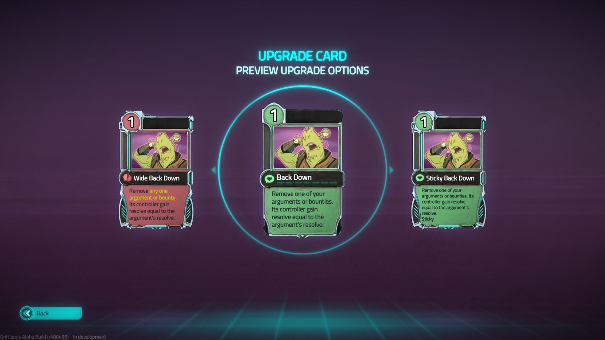
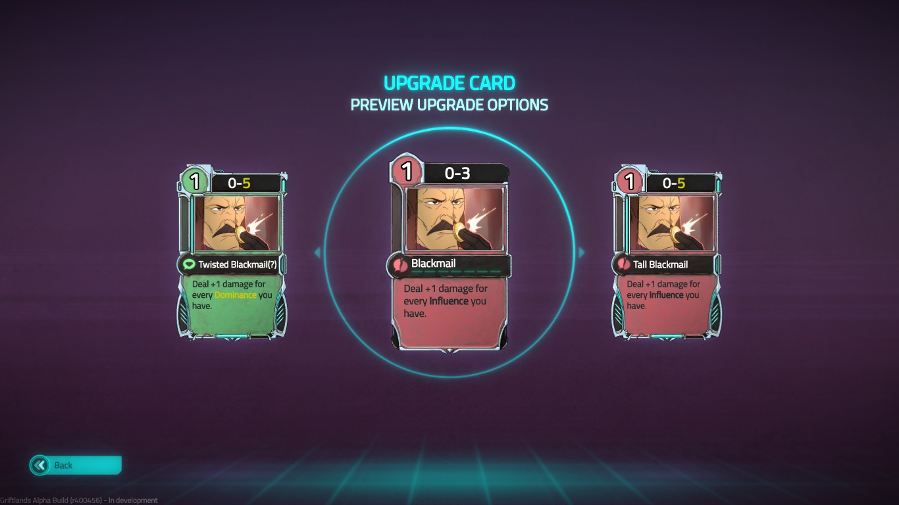
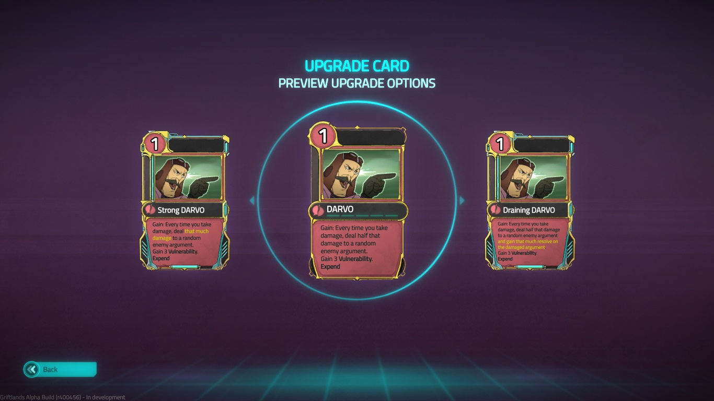
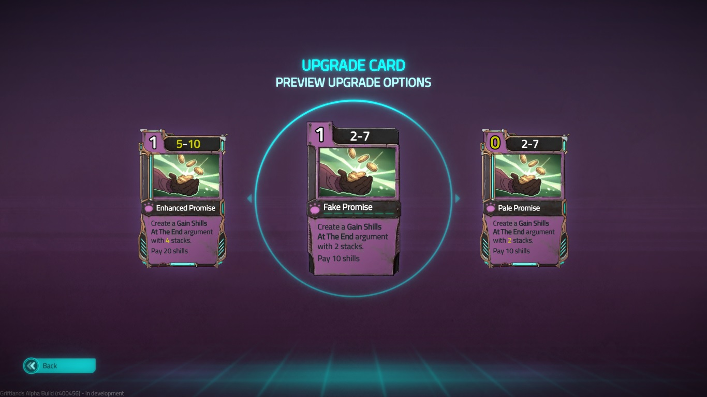
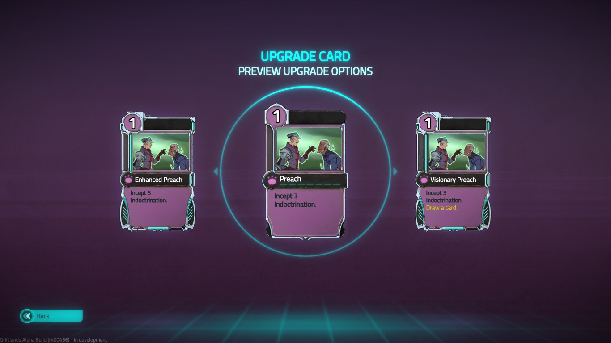
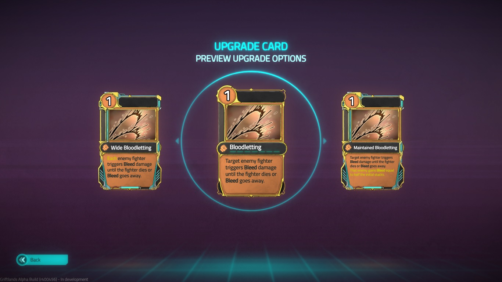
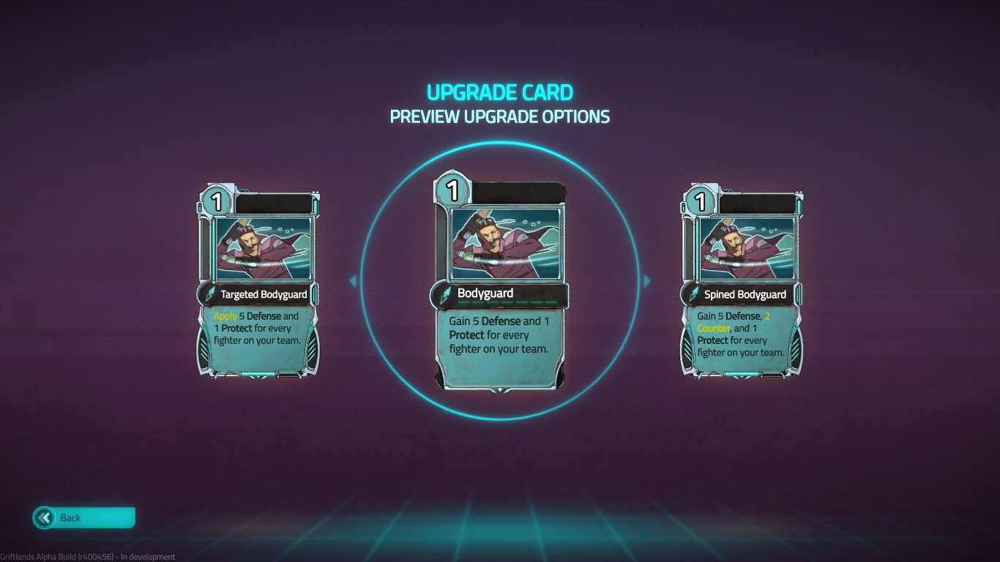
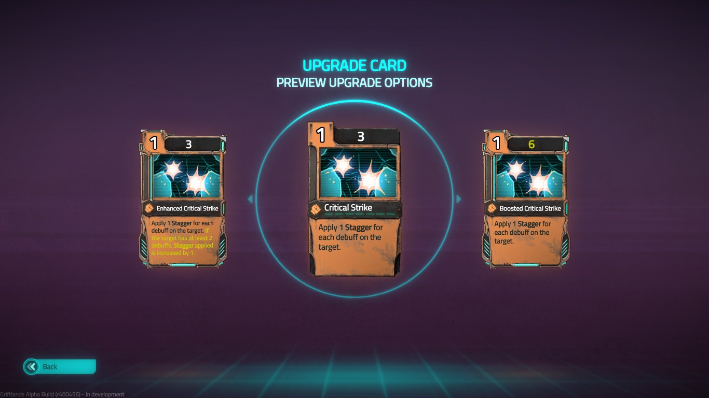

# Notes for specific cards

## Negotiation

### **Back Down**

* Removing an argument on your side does not trigger a bounty, while removing an argument on the opponent's side does. This is to avoid a situation where you accidentally removed an opponent bounty without getting the benefits.

### **Blackmail**

* For **Blackmail** and **Tall Blackmail**, because they are still hostile cards, they are still affected by **Dominance**. Similarly, because **Twisted Blackmail** is still a diplomacy card, it is still affected by **Influence**.
* This card is changed from uncommon to common due to it having to little damage output without synergy.

### **DARVO**

* The amount of damage reflected is rounded down.
* Because damage reflected is still dealt as damage, it will be affected by modifiers such as **Vulnurability**
* Originally, **Draining DARVO** is supposed to negate half of the incoming damage, but I have no idea how to change the damage when an argument is about to take damage, so now it heals instead of damage never happens. Can probably leads to broken combos like heal everything to a ridiculous amount.
* Because trample damage is a seperate instance of damage, this card will try to reflect that damage as well, resulting in more than the expected amount of total damage being reflected.
* The argument created by this card can still reflect damage immediately after it becomes destroyed, but won't reflect trample damage.

### **Fake Promise**

* **Gain Shills At The End** is a bounty which has "Gain 5 shills at the end of this negotiation for each stacks on this bounty if this bounty still exists, regardless whether you win or lose."
* You have to have at least shills equal to the cost indicated on the card in order to play this. If you don't, then this card becomes a dead card.
* Because there is no event trigger when the game ends, I have to make a workaround for when to give the player the shills. It is very inelegant, so it probably have a lot of bugs. For instance, you probably won't gain anything from the bounties if you concede a negotiation.
* Each **Gain Shills At The End** is created as a seperate instance when the card is used. This will give you many bounties, which can synergize with **Overwhelm**.

### **Preach**

* **Indoctrination** is a bounty created using **Rise Manifesto**. It has "When dismissed, gain 1 **Dominance** per stack. At the end of each turn, gain 1 **Influence** and reduce this argument by 1."
* The amount of **Indoctrination** is changed from this picture. See [CHANGELOG.md] for more details.

## Battle

### **Bloodletting**

* To "trigger **Bleed** damage", the fighter takes damage equal to the stacks of **Bleed** on them and reduce the amount of **Bleed** by half - or whatever the decay rate of **Bleed** is at that time - rounded up. This can be affected by conditions such as **Cleaved**(which reduces the decay rate to 0%) and grafts. For the purpose of this card, **Bleed** always decays by 1, otherwise an enemy with **Bleed** and **Cleaved** will instantly die.
* To "trigger **Bleed** damage until the fighter dies or **Bleed** goes away", repeat the above process until:
  * The fighter dies
  * The amount of **Bleed** on the fighter is reduced to 0.
* If an enemy dies this way, the player of this card is the cause of the death, which will cause that enemy's friend to hate the player.
* **Maintained Bloodletting** has an additional clause that applies **Bleed** equal to half of the initial stacks(rounded down). This happens after the previous clause, which means that this **Bleed** will not contribute to the first effect.
* Additionally, effects that affect the decay rate of **Bleed** will not affect how much **Bleed** is applied by **Maintained Bloodletting**.

### **Bodyguard**

* **Protect** is a condition unused in the game. It means "Opponents must target enemies that have **Protect**. Remove one stack when damage is received. Remove **Protect** at the end of your turn.".
* The number of fighters on your team includes you, the player, and any panicking allies.
* If multiple fighters on the same team has **Protect**, the behavior is kind of weird. I think enemies will try to attack their original target first, and if they don't have **Protect**, target someone with **Protect**. This probably also applies to when somehow **Protect** is removed from a fighter.

### **Critical Strike**

* **Stagger** is a condition unused in the game. It means "When **Stagger** reaches 5, clear it and apply 1 **Stun**. Decrease by 1 at the end of your turn.".
* A debuff with a stack size larger than 1 counts as 1 debuff.
* Suprisingly, **Stagger** is not a debuff. I might change it, if I can find a way to change it without changing the source code.
* When the stacks of **Stagger** reaches a number above 5, it applies **Stun**, and the stacks of **Stagger** is reduced by 5.
